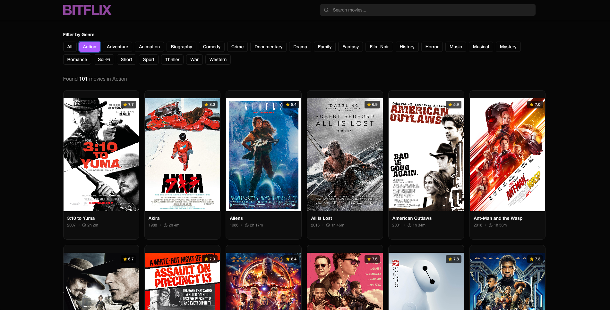

# BITFLIX | Movie Search


# [https://bitflix.bitsofcj.com](https://bitflix.bitsofcj.com)

A [Next.js](https://nextjs.org/)-based movie browsing application with GraphQL integration, featuring search, filtering, and pagination capabilities.



---

## Highlights & Improvements

### Highlights

- **Filter & Realtime Search** - The filter and search functionality work together to allow for searching all movies or searching within a filtered genre, updating movie counts in real-time.
- **User Experience** - The BITFLIX experience is designed to be intuitive and user-friendly, with a focus on providing a seamless and enjoyable movie browsing experience similar to popular streaming platforms.
- **API Proxy** - The API proxy protects the external API authentication & features rate limiting and request timeouts to ensure optimal performance and reliability.

### Improvements
- **Testing** - ✅ Achieved 92.3% test coverage with comprehensive unit, component, integration, and API route tests
- **Caching** - Implement more granular and robust caching strategies in the API proxy (with [Redis](https://redis.io/), [DragonflyDB](https://dragonflydb.io/), [Valkey](https://valkey.io/) or similar technologies) and the frontend (with [Apollo Client](https://www.apollographql.com/docs/react/), [React Query](https://react-query.tanstack.com/), [SWR](https://swr.vercel.app/) or similar technologies).
- **Security** - Implement [helmet.js](https://helmetjs.github.io/) for security headers. Document other security considerations.
- **Documentation** - Maintain comprehensive external documentation for business and developer users with detailed diagrams and examples.
- **Analytics** - Implement [Google Analytics](https://analytics.google.com/), [Microsoft Clarity](https://clarity.microsoft.com/) or any other analytics tool(s) for tracking user behavior and improving the BITFLIX experience.
- **Observability**:
  - Implement structured logging ([winston](https://github.com/winstonjs/winston) or [Pino](https://getpino.io/))
  - Performance monitoring ([Datadog](https://www.datadoghq.com/), [New Relic](https://newrelic.com/), etc...)
  - Update health check endpoint to check dependencies and provide information about the application's status.
- **SEO** - Implement additional SEO best practices for improved search engine rankings.
- **Accessibility** - Implement [ARIA labels](https://www.w3.org/TR/wai-aria-1.2/) on interactive elements & screen reader testing.
- **CI/CD** - Implement continuous integration and deployment pipelines for automated testing and deployment.
- **Tech Stack** - ✅ Migrated to [Next.js](https://nextjs.org/) with App Router for improved performance and SEO.
- **Component Documentation** - Implement [Storybook](https://storybook.js.org/) for component development, testing, and documentation
- **User Experience Enhancements**:
  - Implement sorting by title, release date, rating, etc...
  - Update MovieFilterInput of backend GraphQL server to support searching by actors, directors, writers, publish year, etc...
  - Evaluate the [TMDB API](https://developer.themoviedb.org/reference/getting-started) as a potential tool for supplementing missing movie posters and descriptions, as well as enabling trailer playback in a modal window.
  - Implement lazy loading for movie posters and descriptions to improve initial page load times.
- **State Management** - In the event that BITFLIX becomes more complex, consider implementing more robust state management solutions ([Redux](https://redux.js.org/), [Zustand](https://github.com/pmndrs/zustand), etc..) to handle complex state interactions.
- **Code Formatting** - Implement [Prettier](https://prettier.io/) for consistent code formatting across the project

---

## Features

- **Movie Search** - Real-time search across movie titles
- **Genre Filtering** - Filter movies by genre with exact counts
- **Pagination** - Navigate through large movie collections
- **YouTube Integration** - Click any movie to search for its trailer
- **GraphQL API** - Efficient data fetching with Apollo Client
- **Responsive Design** - Mobile-first UI with Tailwind CSS
- **Caching** - Configurable client-side caching for improved performance
- **Rate Limiting** - Configurable API rate limiting for protection
- **TypeScript** - Full type safety on the frontend

---

## Tech Stack

### Frontend

- **Next.js 16** with App Router
- **React 18** with TypeScript
- **Apollo Client** for GraphQL
- **Tailwind CSS** for styling
- **Lucide React** for icons

### Backend

- **Next.js API Routes** for GraphQL proxy
- **Server-side API key protection** - API keys never exposed to client
- **Request Timeouts** for stability
- **CORS** support

### Testing

- **Jest** for unit and integration tests
- **React Testing Library** for component tests
- **MockedProvider** for GraphQL mocking

### Development Tools

- **Turbopack** for fast builds
- **ESLint** for linting (with Next.js config)

---

## Getting Started

### Prerequisites

- Node.js >= 18.18.0
- npm or yarn

### Installation

1. Clone the repository:

```bash
git clone <repository-url>
cd bitflix-poc
```

2. Install dependencies:

```bash
npm install
```

Note: An `.npmrc` file with `legacy-peer-deps=true` is included to handle peer dependency conflicts with legacy packages.

3. Create a `.env.local` file from the example:

```bash
cp .env.example .env.local
```

Then update the `.env.local` file with your actual API credentials:
- Replace `<your-api-url>` with your movies API URL
- Replace `<your-api-key>` with your API key

---

## Environment Variables

### Client-side Variables (Accessible in browser)

- `NEXT_PUBLIC_GRAPHQL_URL` - GraphQL endpoint URL (default: `/api/graphql`)
- `NEXT_PUBLIC_CACHE_TTL_SECONDS` - Apollo cache TTL in seconds (default: 60)
- `NEXT_PUBLIC_ITEMS_PER_PAGE` - Number of items to display per page (default: 12)

### Server-side Only Variables (API Keys - Secure)

- `MOVIES_API_URL` - Upstream API URL (never exposed to client)
- `MOVIES_API_KEY` - API authentication key (never exposed to client)
- `FETCH_TIMEOUT_MS` - Upstream timeout (default: 10000)

### Running the Application

#### Development Mode

```bash
npm run dev
```

Starts the Next.js development server on http://localhost:3000

#### Production Build

```bash
npm run build
npm start
```

Builds and starts the production server

---

## Testing

### Run All Tests

```bash
npm test
```

Runs all tests once (CI mode)

### Run Tests in Watch Mode

```bash
npm run test:watch
```

Runs tests in watch mode for development

### Run Tests with Coverage

```bash
npm run test:coverage
```

This generates a coverage report in the `coverage/` directory and prints a summary to the console.

### Test Coverage

The project maintains **92.3%** overall statement coverage with the following metrics:

- **92.3%** Statements
- **88.03%** Branches
- **88.09%** Functions
- **93.48%** Lines

### What's Tested

#### Unit Tests

- ✅ **Helpers** (`helpers.test.ts`)
  - `getYear()` - Date parsing and edge cases
  - `formatDuration()` - ISO 8601 duration formatting
  - `getPageNumbers()` - Pagination logic

#### Component Tests

- ✅ **App** (`App.test.tsx`) - Main app component rendering
- ✅ **MovieCard** (`MovieCard.test.tsx`) - Rendering, null handling, YouTube links
- ✅ **Pagination** (`Pagination.test.tsx`) - Navigation, disabled states, page numbers
- ✅ **GenreFilter** (`GenreFilter.test.tsx`) - Loading, selection, filtering
- ✅ **UI Components** (`card.test.tsx`) - Card component variants

#### Integration Tests

- ✅ **MovieBrowser** (`MovieBrowser.test.tsx`)
  - Search functionality
  - Genre filtering
  - Pagination
  - Loading states
  - Error handling
  - Empty states

#### Next.js App Tests

- ✅ **Layout** (`layout.test.tsx`) - Root layout, metadata, structure
- ✅ **Home Page** (`page.test.tsx`) - Page component rendering

#### API Route Tests

- ✅ **GraphQL Proxy** (`app/api/graphql/route.test.ts`)
  - POST endpoint functionality
  - CORS headers
  - Error handling (timeout, network errors)
  - Request body forwarding
  - OPTIONS preflight requests
- ✅ **Health Check** (`app/api/healthcheck/route.test.ts`)
  - GET endpoint functionality
  - Query parameter handling
  - Timeout and error handling
  - Status code preservation

#### Library Tests

- ✅ **Apollo Client** (`apollo-client.test.ts`) - Client configuration, cache policies
- ✅ **ApolloWrapper** (`ApolloWrapper.test.tsx`) - Provider component

---

## Code Quality

### Linting

```bash
npm run lint
```

Runs ESLint with Next.js configuration to check code quality.

---

## Architecture

### Application Architecture

```
app/
├── api/
│   ├── graphql/
│   │   └── route.ts        # GraphQL proxy endpoint
│   └── healthcheck/
│       └── route.ts        # Health check endpoint
├── layout.tsx              # Root layout
└── page.tsx                # Home page

src/
├── components/             # React components
│   ├── ApolloWrapper.tsx  # Apollo Client provider
│   ├── MovieCard/         # Movie display card
│   ├── MovieBrowser/      # Main app container
│   ├── Pagination/        # Page navigation
│   ├── GenreFilter/       # Genre selection
│   └── ui/                # Shared UI components
└── lib/
    ├── apollo-client.ts   # Apollo Client setup
    ├── graphql-queries.ts # GraphQL queries
    ├── graphql-types.ts   # TypeScript types
    └── helpers.ts         # Utility functions
```

### API Routes Architecture

- Next.js API Routes handle server-side logic
- GraphQL proxy at `/api/graphql`
- Health check at `/api/healthcheck`
- API keys secured server-side (never exposed to client)

---

## Performance

- **Apollo Client Caching** - 60-second default TTL (Configurable via environment variable)
- **Request Deduplication** - Apollo prevents duplicate requests
- **Image Optimization** - Lazy loading with error handling
- **Rate Limiting** - Protects against abuse

---

## Security

- **API Key Protection** - API keys only accessible server-side, never exposed to client
- **Next.js API Routes** - Server-side proxy prevents direct API access
- Request timeouts (default: 10s)
- CORS configuration
- No sensitive data in logs
- Environment variables properly scoped (NEXT_PUBLIC_ for client, no prefix for server-only)

---

## License

This project is licensed under the MIT License.
